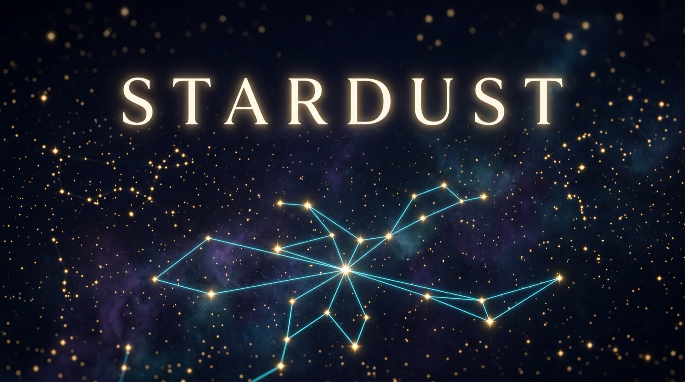

# stardust

<p align="center">
  
</p>

<p align="center">
  <a href="LICENSE"></a>
  
  
</p>

Local search, filter, categorize, and export for your GitHub starred repositories. A Claude Code skill plus a self-contained Python CLI.

Turn your starred repos into a searchable second brain. When you ask Claude "what have I starred about vector databases," stardust queries your local store instead of making Claude guess.

Built as a sibling to [fieldtheory](https://github.com/fieldtheory-ai/fieldtheory-cli) (same idea, for X/Twitter bookmarks). Inspired by [StarListify](https://github.com/nhtlongcs/StarListify) for the README-based topic extraction and preference-driven categorization patterns.

## See it work

<p align="center">
  
</p>

## What it does

- **`stardust sync`** pulls your stars via `gh api` into a local SQLite store with FTS5 search
- **`stardust search <query>`** full-text search over descriptions, topics, and READMEs
- **`stardust list --language rust --topic cli`** filter by any combination of language, topic, owner, date, category
- **`stardust show <owner/repo>`** full detail on one star
- **`stardust stats`** distribution by language, category, domain, year
- **`stardust classify --preferences "..."`** LLM-categorize each star (uses `claude -p`)
- **`stardust md --out DIR`** export to markdown with frontmatter, for Obsidian vaults or any kb

No external dependencies beyond the Python stdlib and the `gh` CLI.

## Installation

### Via Claude Code plugin marketplace

```
/plugin marketplace add kjmagnan1s/stardust
/plugin install stardust@stardust
```

That's it. The first time you ask Claude to do anything with your stars, the skill will run `stardust install` itself, which symlinks the CLI to `~/.local/bin/stardust` (no sudo needed). If `~/.local/bin/` isn't already on your PATH, the installer prints the one-line shell-rc export you need.

If you'd rather set it up manually right away:

```bash
python3 ~/.claude/plugins/marketplaces/stardust/skills/stardust/scripts/stardust.py install
```

### Manual install (without Claude Code)

```bash
git clone https://github.com/kjmagnan1s/stardust.git
cd stardust
python3 skills/stardust/scripts/stardust.py install
```

That runs the same self-installer and puts `stardust` at `~/.local/bin/stardust`.

If you use another skills-compatible agent (Codex CLI, OpenCode), drop `skills/stardust/` into the agent's skills directory per its docs. The skill follows the [Agent Skills specification](https://agentskills.io/specification).

## Quick start

```bash
stardust init                                 # create ~/.github-stars/ + db
stardust sync                                 # pull all stars (uses authenticated gh CLI)
stardust list --language rust --limit 10      # filter
stardust search "vector database"             # FTS search
stardust show anthropics/claude-code          # detail
stardust stats                                # distribution
stardust classify                             # LLM categorize
stardust md --out ./github-stars              # markdown export
```

## Requirements

- Python 3.10+ (stdlib only, no pip install)
- `gh` CLI, authenticated ([install](https://cli.github.com/))
- Optional: `claude` CLI on PATH, for `stardust classify`

## Data layout

```
~/.github-stars/
└── stars.db          # sqlite with FTS5, one row per starred repo
```

Override location with `STARDUST_HOME=/alt/path`.

Safe to delete and resync. GitHub is the source of truth.

## Running tests

```bash
cd skills/stardust
python -m pytest tests/ -v
```

36 tests covering schema, sync idempotency, filters, FTS5 search, stats, markdown export, and CLI entry points. Uses a JSON fixture, so no live GitHub calls.

## Why this exists

I star a lot of repos. My stars had become a write-only log. I wanted Claude to be able to answer "what have I starred about agent harnesses" with real citations from my own reading, not hallucinations. `ft` (fieldtheory) does this for Twitter bookmarks. This does it for GitHub stars.

The `stardust md` export also doubles as a daily ingest pipeline for an Obsidian-style knowledge base. Drop the files into a `raw/` folder and any downstream wiki compile step picks them up.

## License

MIT. See [LICENSE](LICENSE).
